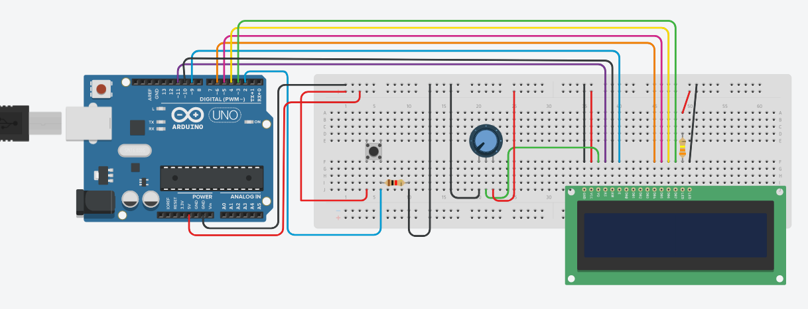

# LCDman
 A small game that can be played on the LCD screen
<h1> Components and supplies </h1>
<ul>
 <li>Arduino Uno</li>
 <li>2x16 LCD Screen</li>
 <li>Breadboard</li>
 <li>Resistor (220 ohm)</li>
 <li>Button</li>
 <li>Jumper Wires</li>
 <li>USB Cable for Arduino</li>
</ul>

<h1>Connections</h1>

<ul>
 <li>Connect VSS to Arduino pin GND </li>
 <li>Connect VCC to Arduino pin 5V </li>
 <li>Connect VO to Potentiometer</li>
 <li>Connect RS to Arduino pin 11</li>
 <li>Connect RW to Arduino pin 10</li>
 <li>Connect E to Arduino pin 9</li>
 <li>Connect D4 to Arduino pin 6</li>
 <li>Connect D5 to Arduino pin 5</li>
 <li>Connect D6 to Arduino pin 4</li>
 <li>Connect D7 to Arduino pin 3</li>
 <li>Connect A to Arduino pin 5V and 120 ohm</li>
 <li>Connect K to Arduino pin GND</li>
</ul>

